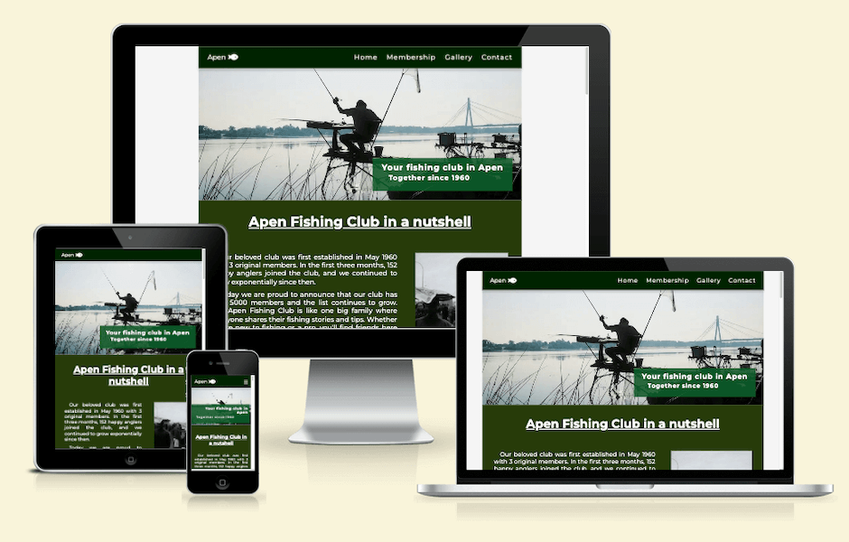

# Apen Fishing Club
[live project on Github](https://zioan.github.io/pp1-fishing-club/)

## Project Description
Apen Fishing Club is, as the name suggests, a website for a fishing club that gives a brief overview of the club and its members.

Users of this website can find out more about the club's history, membership plans and requirements, a short gallery of reviews and media content from other members, as well as a contact form for interested users to get in touch with the club. The website has been created using the responsive-first concept and is responsive on all screen sizes.

## Overview
  - This website is structured as a single-page website with four sections (Home, Membership, Gallery and Contact).
