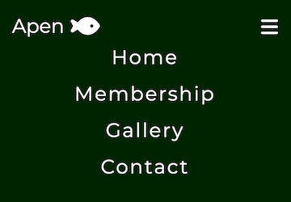
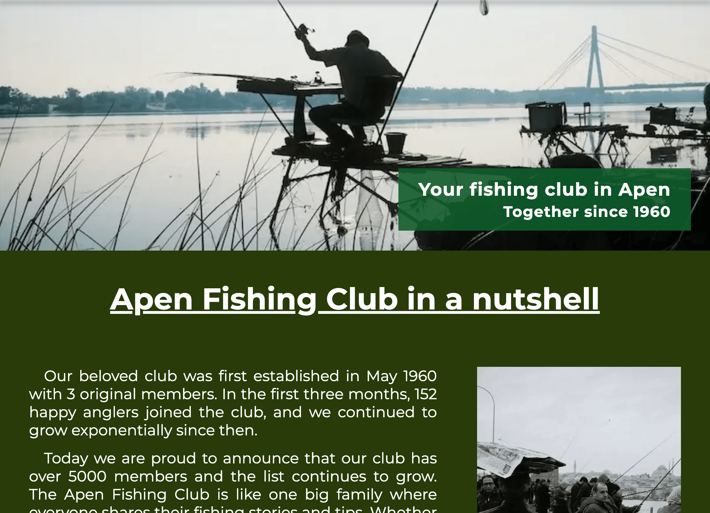
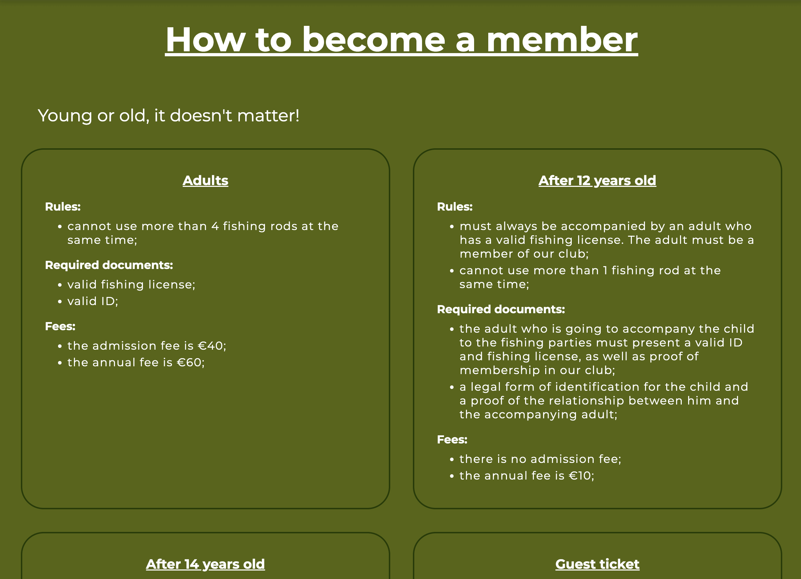
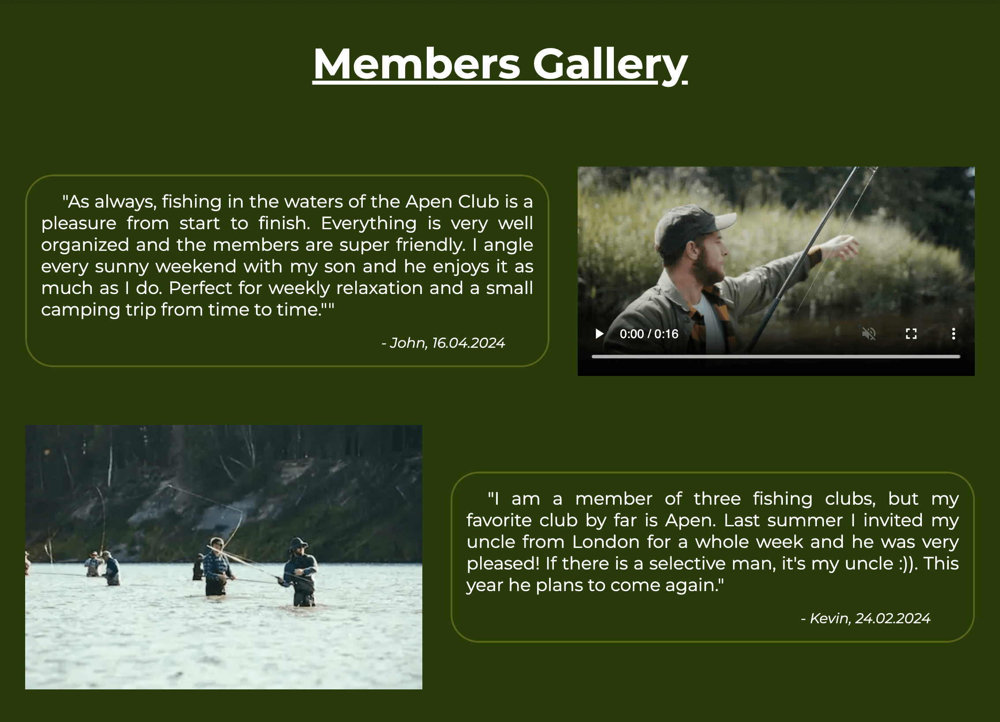
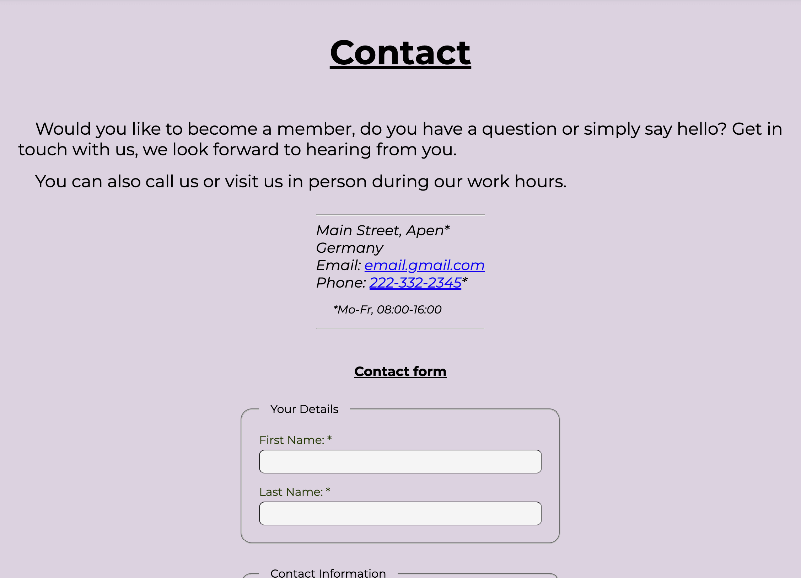
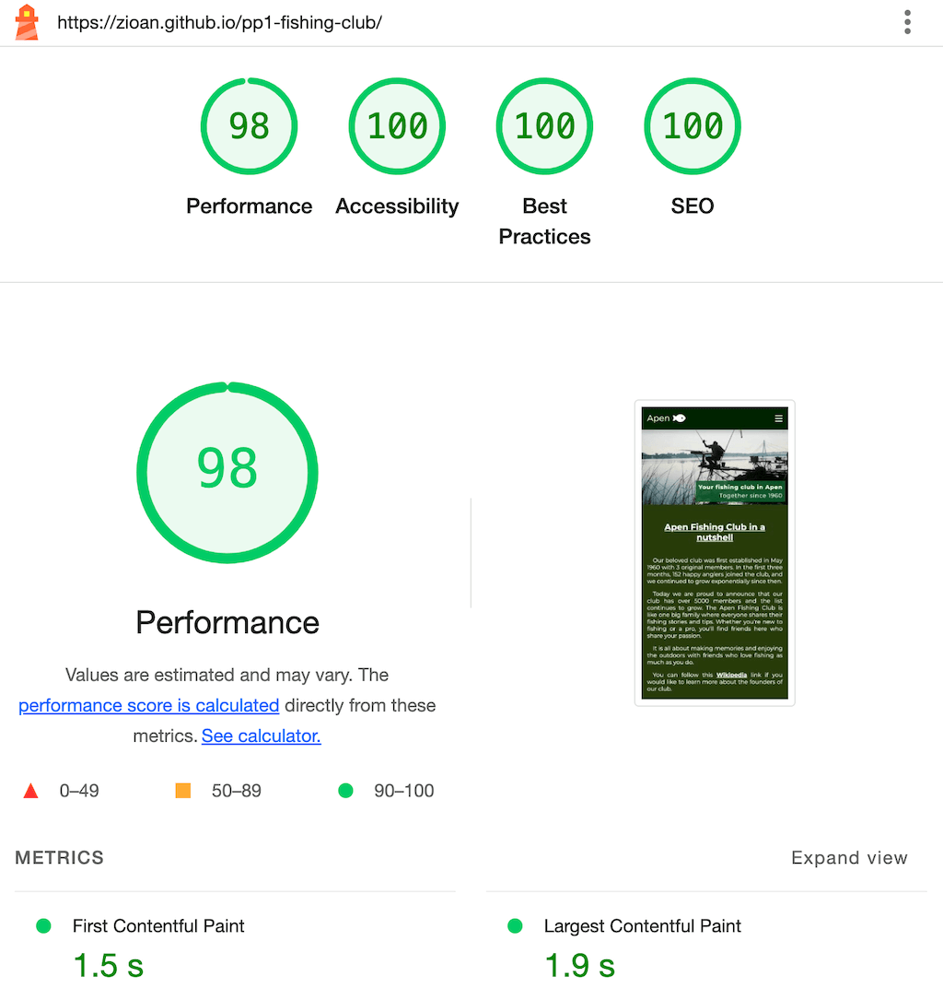
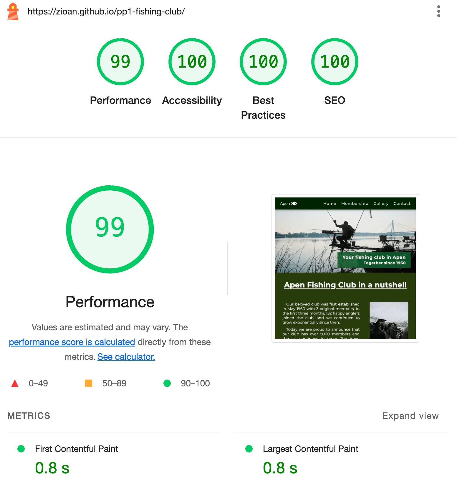
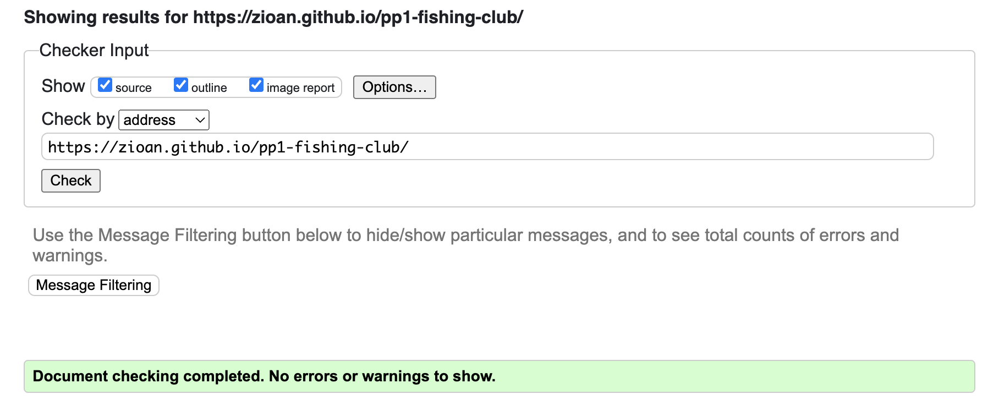
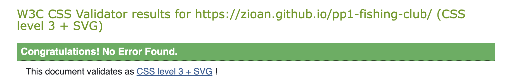
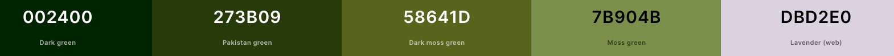

# Apen Fishing Club
[live project on Github](https://zioan.github.io/pp1-fishing-club/)

## Project Description
Apen Fishing Club is, as the name suggests, a website for a fishing club that gives a brief overview of the club and its members.

Users of this website can find out more about the club's history, membership plans and requirements, a short gallery of reviews and media content from other members, as well as a contact form for interested users to get in touch with the club. The website has been created using the responsive-first concept and is responsive on all screen sizes.

## Overview
  - This website is structured as a single-page website with four sections (Home, Membership, Gallery and Contact).

## Features
### Menu Navigation
  - It is located at the top of the website.
  - It has a fixed position at the top, ensuring that users have access to the menu at all times.
  
  - On small screens, when the navigation links do not fit in a single row, the menu transforms into a "hamburger" menu.
  
  - Once the "hamburger" icon is clicked, the menu expands to make navigation links visible to the user.
  

### Home Section
  - It contains a Hero image showing an angler at a beautiful lake and a text overlay with the website headline.
  - It contains an About section in which the user can catch up on the history of the club.

  

### Membership Section
  - It contains a detailed list of the various membership plans based on the age and preferences of the members. The content of this section is separated by horizontal lines on small screens and displayed as cards on larger screens.

  

### Gallery Section
  - It contains stories and media content from club members.

  

### Contact Section
  - It contains an engaging message for the user to contact the club in any manner (email, phone, direct message via the contact form or in person to the club address).
  - It contains an address sub-section where the user can compose an email or initiate a call directly from their device.
  - It contains a contact form in which the user must enter their first and last name, their e-mail address, and the message to be sent to the Club. There is an optional phone field and, if the user is already a member, a field for the membership ID.

  

### Website Footer
  - It contains copyright information and links to social media platforms.

  

## Technologies Used
  - While the focus of this website is HTML5 and CSS3, a small amount of JavaScript code has been added to add a little interactivity.
  - "Montserrat" font was used from <a href="https://fonts.google.com/" target="_blank">Google Fonts</a>.
  - For increased UX, icons from <a href="https://fontawesome.com/icons" target="_blank">Font Awesome</a> was used in this project.

### HTML5
  - The markup has been carefully written to meet the latest accessibility and SEO requirements, taking into account best practice principles, like for example adding <a href="https://developer.mozilla.org/en-US/docs/Web/Accessibility/ARIA/Attributes/aria-label" target="_blank"> aria-label </a> attributes for UI elements that do not have a proper meaning for screen readers.

### CSS3
  - The website was designed from the ground up for small screens (280 pixels and above) and adapted to larger screens using media queries.
  - With regard to large screens, a minimal number of styles were added to reduce loading time and complexity while keeping the website visually appealing.
  - All CSS properties that are considered "advanced concepts" have been carefully checked on <a href="https://caniuse.com" target="_blank"> caniuse.com </a> to ensure good browser compatibility.
  - CSS variables have been used to reduce maintenance time. The color palette and the width of the body can be easily changed.
### Javascript
  - A small amount of JavaScript has been added to make the UI and UX more enjoyable, as following:
#### Logo animation
  - The logo has a small rotation (+30 to -30 degrees) based on the user's scrolling. This is handled by the "scroll" event listener.
#### Responsive menu navigation
  - On small screens (768px and smaller), the "hamburger" icon is displayed and the user interface with the menu links is hidden to create more space for the content. The transition between small and large screens is made with the help of the "resize" event listener and click events.
  - Clicking on menu items also triggers the same functionality to create more space for the content.
#### Membership section animation
  - This animation is using <a href="https://developer.mozilla.org/en-US/docs/Web/API/Intersection_Observer_API" target="_blank">IntersectionObserver API</a> to detect when the content gets into view.

## Testing

### Browser & Manual Testing
  - The website has been tested with the most common browsers (Chrome, Mozilla Firefox, Safari, Microsoft Edge), both on mobile and desktop versions, in a development environment and on real devices.
  - The website has been tested to ensure that it remains responsive and that no overflow can negatively impact the user experience.
  - All external links have been tested for broken paths and it has been ensured that they open in a separate tab
  - The required fields of the contact form have been tested, as well as the email field, to ensure that the user receives correct validation if an incorrect email format is provided.
  - The contact form submission has been tested with partial and full content to ensure good functionality.

### Lighthouse
  - Mobile

  

  - Desktop
  

### Code Validation
  - No errors found running the <a href="https://validator.w3.org/" target="_blank">W3 HTML validator</a>

  

  - No errors found running the <a href="https://jigsaw.w3.org/css-validator/" target="_blank">W3 CSS validator</a>

    

## Bugs
 - This is a browser setting rather than a specific bug. The "smooth" scrolling does not work as intended in Mozilla Firefox. To benefit from the visual effect of smooth scrolling, the user must activate the option "Use smooth scrolling" in the browser settings. In my attempts to fix this "bug" I checked the browser compatibility on <a href="https://caniuse.com" target="_blank">Caniuse.com </a> for the style property I used in CSS (scroll-behavior: smooth;), and I did a more in-depth Google search where I found the relevant information on the "Use smooth scrolling" feature hidden in the Firefox settings.
 - There are no other known bugs.

## Room for Improvements
  - As with all other products resulting from human knowledge and creativity, there is always room for improvement.
  ### Landscape view
  - Improvement of UI and UX in landscape view, especially on narrow screens.
  ### Navigation
  - Adding user feedback to the menu navigation. This is a single page website, adding navigation feedback (where the user is currently on the page) requires more JavaScript to ensure a good user experience.
  - A "Go to top" button can be added for the mobile view.
  ### Design
  - The Membership section can be improved by finding a better way to display the content.
  - and the list can go on...

## Version Control and Deployment
  - The source code for this website is stored on <a href="https://github.com/" target="_blank">GitHub</a>.
  - The repository contains a single branch, and all code has been submitted in small chunks as it was written to ensure a good understanding in case of necessary debugging and further maintenance. The repository can be found at <a href="https://github.com/zioan/pp1-fishing-club" target="_blank">this link</a>, and can be downloaded or cloned using git commands for further local development.
  - For a complete guide on how to clone a Github Repository please follow <a href="https://docs.github.com/en/repositories/creating-and-managing-repositories/cloning-a-repository" target="_blank">this link</a>.
  
## Deployment
  - The website is hosted on <a href="https://pages.github.com/" target="_blank">GitHub Pages</a> and can be accessed via <a href="https://zioan.github.io/pp1-fishing-club/" target="_blank">this link</a>.

## Credits
  - A big thank you for my mentor Spencer for helping me understand the requirements and guiding me through the realization of this project!
  ### Media
  - The images used in this project are from <a href="https://unsplash.com/" target="_blank">Unsplash</a>;
  - The video file is from <a href="https://coverr.co/" target="_blank">Coverr</a>
  - The small arrow image used in the Gallery section for large screens is from <a href="https://uxwing.com/" target="_blank">UXWings</a>
  - The logo and social media icons are from <a href="https://fontawesome.com/icons" target="_blank">Font Awesome</a>
  - The favicon is made by me using a screenshot from the logo, and Mac image editor capability. 
  ### Text Content and JavaScript Code
  - The text content and JavaScript code were created by me. Thanks to previous professional coding experience, I was able to easily put together the implementation of the JavaScript logic.
  ### Tools
  - <a href="https://convertio.co/" target="_blank">Convertio</a> helped me to convert the images from JPG to WebP format.
  - <a href="https://tinypng.com/" target="_blank">TinyPNG</a> was used to optimize the images for web.
  - <a href="https://www.veed.io/" target="_blank">Veed.io</a> was used to reduce the video resolution making it more suitable for this project.
  - <a href="https://caniuse.com" target="_blank">Caniuse.com </a> was used to check browser compatibility for multiple javaScript and CSS features.
  ### Documentation and Inspiration
  - For this website a color pallet generated from <a href="https://coolors.co" target="_blank">coolors.co</a> was used.
  
  - I used <a href="https://www.w3schools.com/" target="_blank">W3School</a> and <a href="https://developer.mozilla.org/" target="_blank">Mozilla Developer Docs</a> to research and understand some aspects used in this project, such as the best practice for the "aria-label" attribute and the "IntersectionObserver API" use case.
